# Webアプリケーション

## Webアプリケーションとは

Webアプリケーションとは、Webブラウザ[^1]（以降、ブラウザ）を使用し、場合によってはサーバと通信をするアプリケーションです。

単純なWebサイトの場合には、次の画像のようにブラウザの要求（URL）を受け付けたサーバが、要求されたファイル（HTMLやCSS、画像等）を返すという構造になっています。

存在するファイルを返すだけなので、固定の決まりきった内容だけが表示されます。

それに対して、Webアプリケーションは、次の画像のようにブラウザの要求を受け付けて、その要求に対してWebサーバ上（場合によっては別のサーバになることもあります）でプログラムが動作します。プログラムでは主にHTMLが作成されて、要求のあったブラウザに返すという流れになります。

このサーバでHTMLを作成して返す方式を書籍「[Webブラウザセキュリティ](https://www.lambdanote.com/products/wbs)[^2]」の言葉で、以降クライアントサイドWebアプリケーションと呼びます。

[^1]: WindowsだとMicrosoft EdgeやGoogle Chrome、Firefox。iPhoneだとSafari。AndroidだとGoogle Chromeがよく使われています。
[^2]: 米内貴志著『Webブラウザセキュリティ ― Webアプリケーションの安全性を支える仕組みを整理する』第1版、ラムダノート株式会社、2021年
