# 開発準備

## JDKについて

Javaでプログラムを作るためには、JDK（Java Development Kit）が必要になります。JDKはJavaでプログラムを作るために必要なツールをまとめたものになります。

現在JDKはいろいろなものがありますが、ここでは[OpenJDK](https://openjdk.java.net/)を使用します。

その他のJDKに関しては、次の資料が詳しいので参考にしてください。

[JDKの選択肢とサーバーサイドでの選び方](https://www.slideshare.net/TakahiroYamada3/how-to-choose-jdk-for-server-side-20191004-gugj)

## 環境について

ここでは、Windows 10にServlet開発環境を作っていきます。

Eclipseのフォルダー階層が深くなるとあまり良くないので、すべてのファイルを`C:\dev\Servlet`以下に置きます。以下、その前提で記載します。

## インストール

### OpenJDKのインストール

OpenJDKは、[https://jdk.java.net/15/](https://jdk.java.net/15/)からダウンロードします。ダウンロードは、図のように**Windows/x64**のzipファイルをダウンロードします。

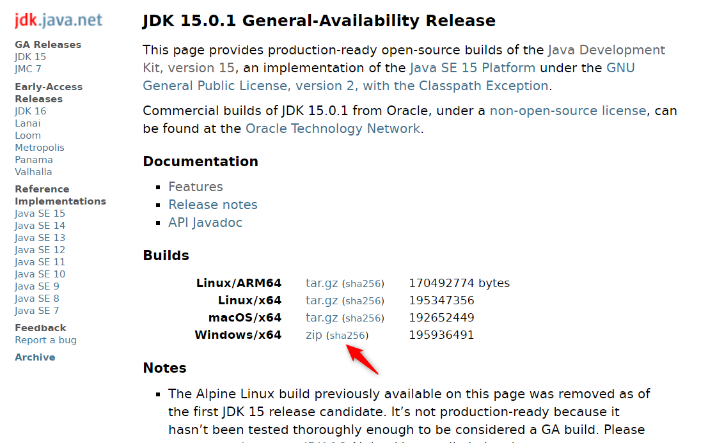

現時点では、OpenJDKのバージョンが15.01のため、ダウンロードしたファイルを展開すると`jdk-15.0.1`というフォルダーができます。このフォルダーを`C:\dev`フォルダーに移動してください。

### Eclipseのインストール

[Eclipseのページ](https://www.eclipse.org/)で「Download」ボタンを押して、次の画面で「Download Packages」のリンクを押します。

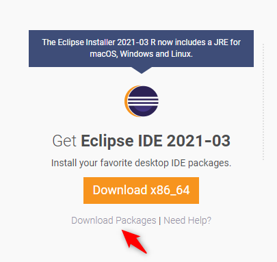

次の画面で、「Eclipse IDE for Enterprise Java Developers」のものをダウンロードしてください。


ダウンロードしたファイルを展開すると`eclipse`というフォルダーができます。このフォルダーを`C:\dev`フォルダーに移動してください。

### Tomcatのインストール

[Tomcatのページ](https://tomcat.apache.org/download-90.cgi)で「Core」の「zip」リンクを押します

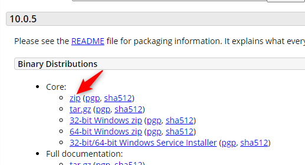

現時点では、Tomcatのバージョンが9.0.40のため、ダウンロードしたファイルを展開すると`apache-tomcat-9.0.40`というフォルダーができます。このフォルダーを`C:\dev\Servlet`フォルダーに移動してください。

### Eclipseのワークスペースの作成

Eclipseはワークスペースという、Eclipse内で作成するファイルを置く場所を決める必要があります。今回は、`C:\dev\Servlet`の中に`ws`というフォルダーを作成し、ここをワークスペースとします。

### Eclipse起動用のショートカットの作成

Eclipseのショートカットに、起動時の設定をしておくことができます。

まず、Eclipseのショートカットを作成します。本体は`C:\dev\eclipse\eclipse.exe`です。このショートカットを任意の場所に作ってください。

ショートカットのプロパティを開き、リンク先を次の内容にしてください。

```
C:\dev\Servlet\eclipse\eclipse.exe -vm C:\dev\Servlet\jdk-15.0.1\bin\javaw.exe -data C:\dev\Servlet\ws -vmargs -Dfile.encoding=utf-8
```

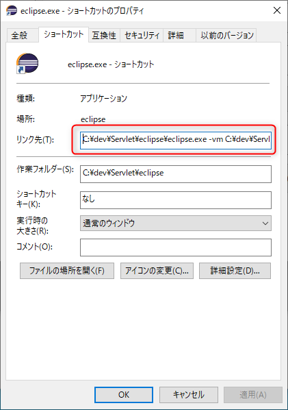

## プラグインのインストール

プラグインは、特にインストールしません。

## 設定

最低限の設定をします。設定は「Window」メニューから「Preferences」を選択します。

### フォントの設定

プログラムを書く上でフォントは大事です。例えば、半角のスペースと全角のスペースの区別がつくか、0（ゼロ）とO（オー）の区別かつくかといったことがあります。今回は[Cicaフォント]
([https://github.com/miiton/Cica](https://github.com/miiton/Cica))を使います。

設定は、「General」>「Appearance」>「Colors and Fonts」で開いた画面で「Basic」の中の「Text Font」を選択した状態で、「Edit」ボタンを押し`Cica`フォントを選択します。

### Javaのフォーマッターの設定

プログラムはどの位置で改行するか、インデントに何文字入れるかといったことが人によって違ったりします。仕事をする上で、それらがまちまちだと困るので、通常はフォーマッターを使い改行文字の入れ方やインデントの入れ方を機械的に統一します。フォーマッターの設定は「Java」>「Code Style」>「Formatter」で設定します。ここでは一例を示しますが、任意の形にしてください。

フォーマッターを設定する場合には「New」ボタンを押し、フォーマッターの名前を決めます。ここでは`Basic`としておきます。作った上で、「Edit」ボタンを押し変更していきます。今回は、「Indentation」の「Tab policy」を「Spaces only」にします。

もう一点、`static import`の場合には、`import`に*を使ってほしいため、「Java」>「Code Style」>「Organize Imports」を選び、画面の下部にある「Number of static imports needed for .*」を`1`にします。

### Tomcatの設定

「Server」>「Runtime Environments」を選択し「Add」ボタンを押します。今回はTomcat 9をインストールしたので「Apache Tomcat v9.0」を選択し「Next」を押します。「Tomcat installation directory」にTomcatをインストールしたディレクトリー`C:\dev\apache-tomcat-9.0.40`を指定します。

設定したら、設定のダイアログを閉じます。画面下部の「Servers」タブを選択し、「No servers are available. Click this link to create a new server.」を押します。

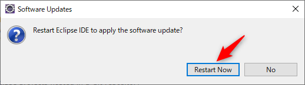

「Tomcat v9.0 Server」を選択し、「Finish」を押します。

## 使い方

ここで1つWebアプリケーションを作成して動かし方を確認します。

まず、プロジェクトを作成します。1つのプロジェクトが1つのWebアプリケーションになります。

プロジェクトの作成は「File」メニューから「New」>「Dynamic Web Project」を選択します。

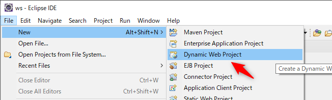

ダイアログで「Project name」に`hello`と入れて「Finish」を押します。

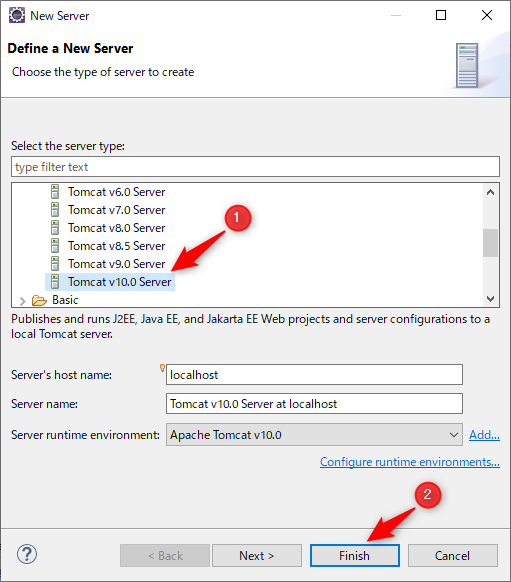

「Project Explorer」にプロジェクトが表示されるので「Java Resources」>「src」の順に展開していきます。Javaのプログラムはこの「src」の中に作成します。

実際にプログラムを作成します。「src」を右クリックし、「New」>「Servlet」を選びます。

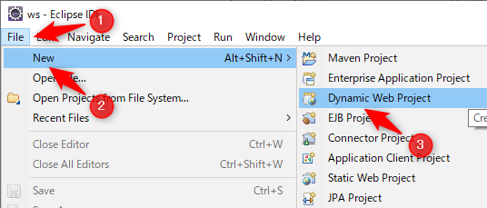

「package」に`hello`、「Class name」に`HelloServlet`と入力し、「Next」を押します。Servletでは**必ず**パッケージを宣言するようにしてください。

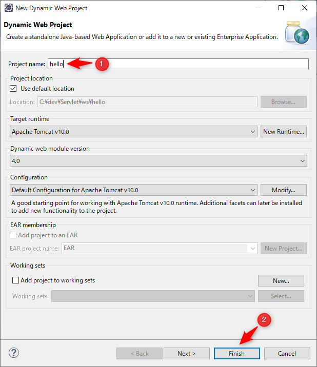

次の画面は、そのまま「Next」を押します。

最後の画面では、「Constructors from superclass」と「doPost」のチェックを外し、「Finish」を押します。

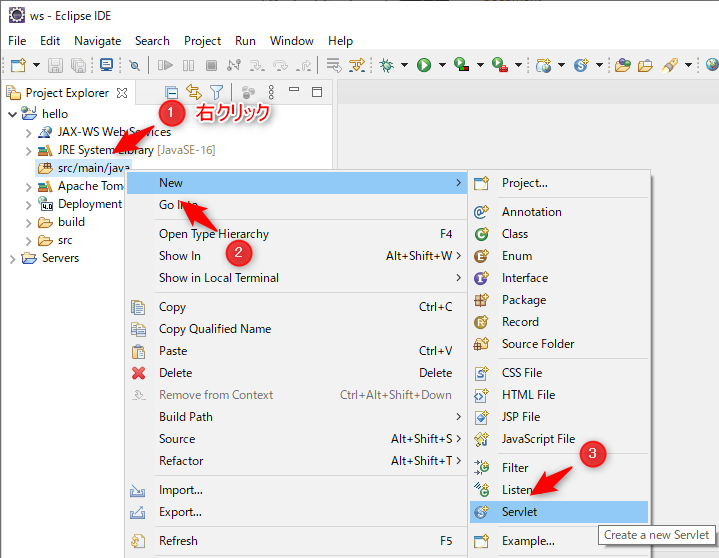

自動生成されるコメントは不要ですので削除し、`doGet`メソッドの中を次のように変更します。

```java
package hello;

import java.io.IOException;
import javax.servlet.ServletException;
import javax.servlet.annotation.WebServlet;
import javax.servlet.http.HttpServlet;
import javax.servlet.http.HttpServletRequest;
import javax.servlet.http.HttpServletResponse;

@WebServlet("/HelloServlet")
public class HelloServlet extends HttpServlet {
    private static final long serialVersionUID = 1L;

    protected void doGet(HttpServletRequest request, HttpServletResponse response) throws ServletException, IOException {
        try (var pw = response.getWriter()) {
            pw.println("hello servlet");
        }
    }
}
```

これでプログラムの準備は完了です。最後に実行して確認します。実行するには、作成しているアプリケーションをTomcatに登録しておく必要があります。

Eclipseの下部の「Servers」タブを選択し、表示されている「Tomcat v9.0 Server at localhost」の部分を右クリックし「Add and Remove」を選択します。


表示される画面では、Tomcatへの登録と登録解除を決定できます。「Available」にあるものが登録されていないもの、「Configured」にあるものが登録されているものになります。今回は、「hello」を登録したいので「hello」を選択し「Add」を押します。

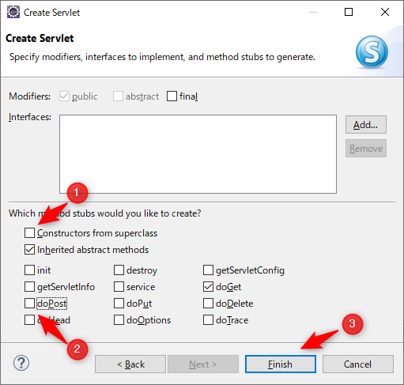

登録はこれで完了したので、Tomcatを起動しアプリケーションの動作確認をします。画面下のTomcatを選択し、「実行」ボタンを押します。

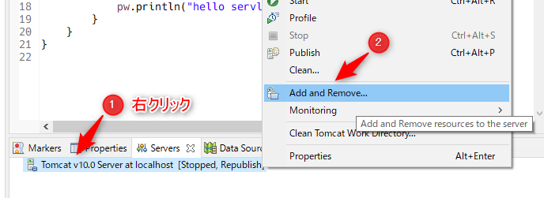

そうすると、いろいろな文字が出ますがTomcatが「Started」と表示されれば起動が完了しています。

最初の起動時だけ、Windows Defenderのファイアウォールの確認が出ますので、「アクセスを許可する」を選んでください。

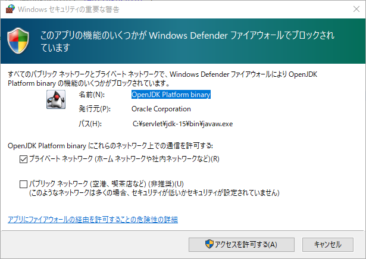

起動を確認したら、好きなブラウザーを起動し[http://localhost:8080/hello/HelloServlet](http://localhost:8080/hello/HelloServlet)にアクセスしてください。問題なければ、次のように表示されるはずです。

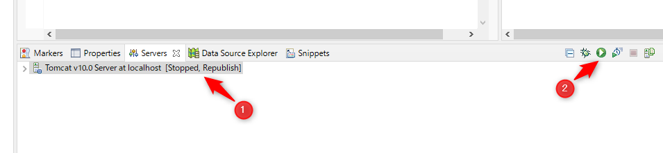

これで確認完了です。Tomcatを停止するには、実行ボタンの右側に停止ボタンがあるので、それを押します。

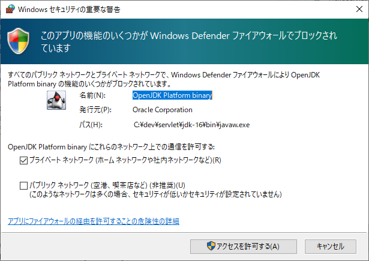
