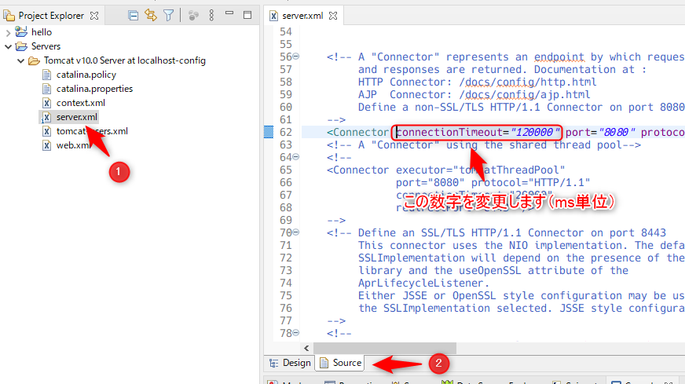
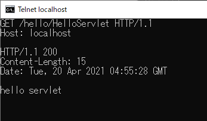

# HTTP

## telnetの準備

Windows 10ではTelnetクライアントは標準では入っていません。最初にTelnetクライアントをインストールします。

コントロールパネルから「プログラムのアンインストール」を選択します。


「Windowsの機能の有効化または無効化」を選びます。


「Telnetクライアント」にチェックを入れて++"OK"++を押します。


インストールが始まるので、終わるまで待ちます。


## Tomcatの設定変更

デフォルトの設定だとリクエストの受付は20秒で終了してしまいます。これでは入力するのが厳しいので、リクエストのタイムアウトの時間を変更します。EclipseのProject Explorerの「Servers」を展開していくと`server.xml`というファイルがあるので、このファイルを開きます。

開くと、エディタの下部のタブが++"Design"++になっているので++"Source"++に変えます。



## telnetでHTTP接続してみる

第2章で作成したWebアプリケーションを再度起動します。その後、コマンドプロンプトを起動します（スタートメニューから「Windowsシステムツール」の中にあります）。起動後、以下のコマンドを入力します。

```
telnet localhost 8080
```

そうすると、真っ黒の画面が表示されるので、++ctrl+"]"++（++ctrl++キーを押しながら++"]"++を押す）を押します。そうすると文字が出でくるので、次のコマンドを入力して++enter++を2回押します。

```
set localecho
```

そして、次のHTTPのリクエストを投げます。`Host`の行の最後で++enter++を2回押します。

```
GET /hello/HelloServlet HTTP/1.1
Host: localhost

```

うまくいくと次のように表示されます。



```
GET /hello/HelloServlet HTTP/1.1
Host: localhost

HTTP/1.1 200
Content-Length: 15
Date: Tue, 20 Apr 2021 04:55:28 GMT

hello servlet
```

上記、1行目と2行目が入力した部分で、この部分がHTTPのリクエストにあたります。


