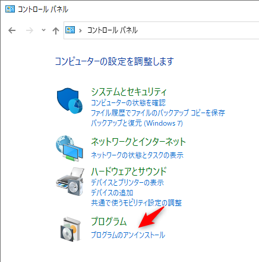
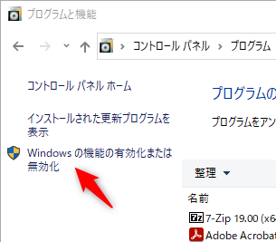
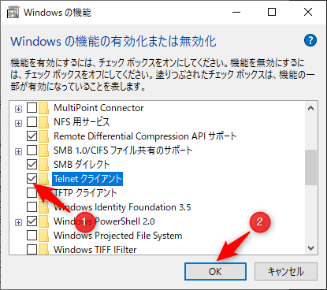
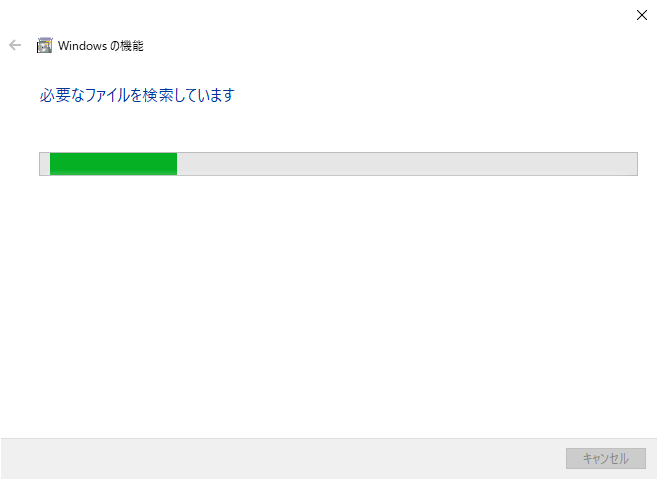

# HTTP

## telnetの準備

Windows 10ではTelnetクライアントは標準では入っていません。最初にTelnetクライアントをインストールします。

コントロールパネルから「プログラムのアンインストール」を選択します。



「Windowsの機能の有効化または無効化」を選びます。



「Telnetクライアント」にチェックを入れて++"OK"++を押します。



インストールが始まるので、終わるまで待ちます。



## telnetでHTTP接続してみる

第2章で作成したWebアプリケーションを再度起動します。その後、コマンドプロンプトを起動します（スタートメニューから「Windowsシステムツール」の中にあります）。起動後、以下のコマンドを入力します。

```
telnet
open localhost 8080
GET / HTTP/1.1
Host: example.com
```

そうすると、真っ黒の画面が表示されるので、++ctrl+"]"++（++ctrl++キーを押しながら++"]"++を押す）を押します。そうすると文字が出でくるので、次のコマンドを入力して++enter++を2回押します。

```
set localecho
```

そして、次のHTTPの

```
GET /hello/HelloServlet HTTP/1.1
```
